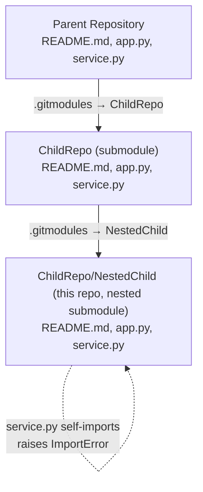
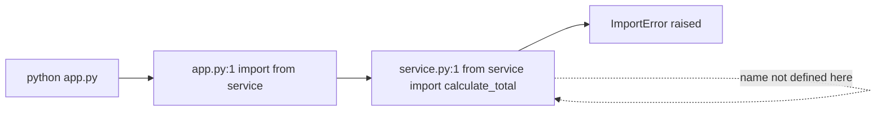

# ChildRepo/NestedChild — Modular Sum/Average Demo (Nested Submodule)

## Overview

`ChildRepo/NestedChild` is a minimal, dependency-free Python demonstration of the
same modular-arithmetic shape as the parent repository and `ChildRepo`: a small
console entry point (`app.py`) that is intended to drive a reusable helper module
(`service.py`). It is the **deepest level of a three-level nested Git submodule
chain**: **parent → `ChildRepo` → `NestedChild`**. `Source: ChildRepo/.gitmodules`,
`Source: .gitmodules`.

> **⚠️ This nested copy is BROKEN at runtime.** Unlike the parent and `ChildRepo`,
> this level's `service.py` is a **misplaced copy of `app.py`** — it defines only
> `main()` and, on its first line, performs a **self-import**
> `from service import calculate_total`. Because this file never defines
> `calculate_total`, importing or running the app raises `ImportError`, so there
> is **no `Total: 100` output at this level**. The defect is **documented, not
> fixed**, per the documentation-only scope of this task.
> `Source: ChildRepo/NestedChild/service.py:L1-L16`.

This README mirrors the structure and section ordering of the parent
[`../../README.md`](../../README.md) and the sibling `ChildRepo`
[`../README.md`](../README.md), scoped to this nested level and documenting the
real (failing) behavior.

---

## Repository Structure

`ChildRepo/NestedChild` occupies the innermost level of a three-level submodule
chain: `ChildRepo` embeds it as a nested submodule, and `ChildRepo` is itself a
submodule of the parent repository. The diagram below shows this repository's
place in the chain and highlights the self-import failure at this level
(documented, not fixed — see
[Known Limitations / Troubleshooting](#known-limitations--troubleshooting)).



### File / folder tree

This level contains a console entry point, a (misplaced) helper module, and this
README. There are **no subfolders**. `Source: ChildRepo/NestedChild/app.py:L1-L16`,
`Source: ChildRepo/NestedChild/service.py:L1-L16`.

```text
ChildRepo/NestedChild/
├── README.md          # This file — nested submodule documentation
├── app.py             # Console entry point; defines main() (imports from service)
└── service.py         # Misplaced copy of app.py; defines main() only, self-imports → ImportError
```

> **Note:** `large.csv` also exists at this level but is **excluded from Blitzy
> viewing/documentation by `.blitzyignore` (`*.csv`)**; it is still tracked by
> Git. Its contents are intentionally not viewed or described here.
> `Source: ChildRepo/NestedChild/.blitzyignore:1`.
> This repository is the deepest level of the chain, so it declares **no
> submodules of its own** and contains no further `.gitmodules` file.

### Submodules

There is no submodule declared *inside* this repository (it is the deepest
level). For context, the wiring that places this repository into the chain is
declared one level up, in `ChildRepo/.gitmodules`. `Source: ChildRepo/.gitmodules`.

| Declared in           | Submodule path          | Repository URL                                                 |
|-----------------------|-------------------------|----------------------------------------------------------------|
| `ChildRepo/.gitmodules` | `NestedChild`         | `https://github.com/lakshya-blitzy/600K_Nested_ChildRepo.git`  |

For completeness, the parent repository declares `ChildRepo` as a submodule at
`https://github.com/lakshya-blitzy/600K_ChildRepo.git`. `Source: .gitmodules`.

**Navigation:** Up to the child submodule's documentation, see
[`../README.md`](../README.md) (i.e., `ChildRepo/README.md`); up to the parent
repository, see [`../../README.md`](../../README.md). There is **no link "down"** —
this is the deepest level of the chain.

---

## Prerequisites

| Requirement           | Details                                                                                  |
|-----------------------|------------------------------------------------------------------------------------------|
| Python **>= 3.6**     | Required for the f-string formatting used by the entry point. `Source: ChildRepo/NestedChild/app.py:L8` |
| Git (submodule-aware) | Needed to clone and initialize the nested submodule repositories. `Source: Git SCM documentation, "Git Tools - Submodules" (https://git-scm.com/book/en/v2/Git-Tools-Submodules)` |
| Third-party packages  | **None.** The project uses only the Python standard library; the repository tree contains no dependency manifest (no `requirements.txt`, `pyproject.toml`, or `setup.py`). `Source: repository file tree (see [Repository Structure](#repository-structure))` |

> **Verified interpreter:** The runtime behavior documented in
> [Usage / Running](#usage--running) was verified on **CPython 3.13.7**. The
> program's import-time failure is deterministic on any supported version, but
> the exact `ImportError` diagnostic text is CPython-version dependent (see
> [Usage / Running](#usage--running)). `Source: ChildRepo/NestedChild/service.py:L1-L16`.

---

## Setup / Installation

**Git does not download submodule contents by default.** If you clone without
initializing submodules, the `ChildRepo/` and `ChildRepo/NestedChild/`
directories will be **empty**. Use the recursive workflow below so that every
submodule — including this nested one — is populated. The `--recurse-submodules`
flag initializes and clones every submodule recursively, which also covers nested
submodules.
`Source: Git SCM documentation, "Git Tools - Submodules" (https://git-scm.com/book/en/v2/Git-Tools-Submodules)`.
The submodule paths and URLs referenced here are declared in the `.gitmodules`
files at each level. `Source: ChildRepo/.gitmodules`, `Source: .gitmodules`.

```bash
# Clone with all submodules (including nested) initialized
git clone --recurse-submodules <repository-url>

# Or, if already cloned without submodules, populate them:
git submodule update --init --recursive
```

> **Keeping submodules in sync:** Submodules do **not** auto-update when you pull
> parent-repository changes; you must update them manually to match the commit the
> parent references. After pulling the parent, re-run
> `git submodule update --init --recursive`.
> `Source: Git SCM documentation, "Git Tools - Submodules" (https://git-scm.com/book/en/v2/Git-Tools-Submodules)`.

---

## API Documentation

> **IMPORTANT — this level does NOT expose `calculate_total` or
> `calculate_average`.** Unlike the parent and `ChildRepo` `service.py` modules
> (which provide the arithmetic helpers), this level's `service.py` is a
> **misplaced copy of `app.py`** and defines only `main()`. Consequently there is
> no reusable arithmetic API at this level, and the intended
> `from service import calculate_total` cannot be satisfied.
> `Source: ChildRepo/NestedChild/service.py:L1-L16`.

Both modules at this level define the same `main()` entry point (a copy of the
parent's `main()`). Neither can actually run, because importing `service`
raises `ImportError` (see [Usage / Running](#usage--running)).

| Module        | Function | Signature | Behavior / Returns                                                                                                                                                     |
|---------------|----------|-----------|----------------------------------------------------------------------------------------------------------------------------------------------------------------------|
| `app.py`      | `main`   | `main()`  | *Intended:* build `[10, 20, 30, 40]`, print `Total: <total>`, print each number, print `Application completed`; returns `None`. **Fails at import time** before `main()` can run (see Usage). `Source: ChildRepo/NestedChild/app.py:L3-L16` |
| `service.py`  | `main`   | `main()`  | Same intended workflow, but **unreachable** — the line-1 self-import raises `ImportError` before the body can execute. `Source: ChildRepo/NestedChild/service.py:L1-L16` |

> **Contrast with the working levels:** In the parent and `ChildRepo`, `service.py`
> exposes `calculate_total(numbers)` (sum; `0` for an empty list) and
> `calculate_average(numbers)` (`0` for falsey/empty input, else `sum / len`).
> Those helpers are **absent here**, which is the root cause of the failure at
> this level. `Source: ChildRepo/NestedChild/service.py:L1-L16`.

---

## Usage / Running

> **This level fails at runtime — there is NO `Total: 100` output here.** Running
> the entry point raises `ImportError` at import time. The output below is the
> **actual captured behavior**, not a fabricated success.
> `Source: ChildRepo/NestedChild/service.py:L1-L16`.

Run the entry point from within the `ChildRepo/NestedChild` working tree:

```bash
python app.py
```

**Actual output** (captured on **CPython 3.13.7**; process exits with a non-zero
status, exit code `1`). The machine-specific absolute path prefix is shown as
`.../` for readability; line numbers reflect the current source files (after
per-function docstrings were added, the `import` statements sit at `app.py`
line 30 and `service.py` line 37). `Source: ChildRepo/NestedChild/app.py:L1`,
`Source: ChildRepo/NestedChild/service.py:L1`.

```text
Traceback (most recent call last):
  File ".../ChildRepo/NestedChild/app.py", line 30, in <module>
    from service import calculate_total
  File ".../ChildRepo/NestedChild/service.py", line 37, in <module>
    from service import calculate_total
ImportError: cannot import name 'calculate_total' from 'service' (consider renaming '.../ChildRepo/NestedChild/service.py' if it has the same name as a library you intended to import)
```

Running `python service.py` directly fails **identically** (also exit code `1`),
because `service.py` re-imports the name `calculate_total` from itself.
`Source: ChildRepo/NestedChild/service.py:L1-L16`.

**Why it fails (one sentence):** `service.py` is named `service`, so its line-1
statement `from service import calculate_total` is a **self-import** — the module
asks for a name from itself before it has finished initializing, and because this
file never defines `calculate_total`, the import raises `ImportError`.
`Source: ChildRepo/NestedChild/service.py:L1-L16`.

> **CPython-version note (message text is version dependent):** The failure itself
> is stable, but the exact `ImportError` message differs by interpreter. CPython
> **3.13** reports the message shown above (`... from 'service' (consider renaming
> ... )`), whereas CPython **3.12** reports:
>
> ```text
> ImportError: cannot import name 'calculate_total' from partially initialized module 'service' (most likely due to a circular import)
> ```
>
> Do not treat either wording as the single universal message; the invariant is
> that importing `service` fails with `ImportError`.
> `Source: ChildRepo/NestedChild/service.py:L1-L16`.

---

## Inline Code Explanation

A line-referenced walkthrough of both modules, explicitly explaining why the
self-import breaks execution. (Line references use the original logical code
positions; the runtime traceback in [Usage / Running](#usage--running) shows the
current physical line numbers after docstrings were added.)

### `app.py`

- `ChildRepo/NestedChild/app.py:L1` — imports `calculate_total` from the local
  `service` module, which resolves to the sibling `service.py` in this directory.
  `Source: ChildRepo/NestedChild/app.py:L1`.
- `ChildRepo/NestedChild/app.py:L3` — defines the `main()` entry-point function.
  `Source: ChildRepo/NestedChild/app.py:L3-L16`.
- `ChildRepo/NestedChild/app.py:L4` — defines the fixed input list `[10, 20, 30, 40]`.
  `Source: ChildRepo/NestedChild/app.py:L3-L16`.
- `ChildRepo/NestedChild/app.py:L6` — would compute the total via the
  `calculate_total` helper. `Source: ChildRepo/NestedChild/app.py:L3-L16`.
- `ChildRepo/NestedChild/app.py:L8` — would print `Total: {total}` using an
  f-string (requires Python >= 3.6). `Source: ChildRepo/NestedChild/app.py:L8`.
- `ChildRepo/NestedChild/app.py:L10-L11` — would loop over the list and print each
  number on its own line. `Source: ChildRepo/NestedChild/app.py:L3-L16`.
- `ChildRepo/NestedChild/app.py:L13` — would print the literal `Application completed`.
  `Source: ChildRepo/NestedChild/app.py:L3-L16`.
- `ChildRepo/NestedChild/app.py:L15-L16` — the `__main__` guard runs `main()` only
  on direct execution. `Source: ChildRepo/NestedChild/app.py:L15-L16`.

Because `app.py` imports from `service` at module load time
(`ChildRepo/NestedChild/app.py:L1`), the failure in `service.py` propagates
immediately and `main()` is never reached.

### `service.py`

- `ChildRepo/NestedChild/service.py:L1` — **the defect.** The statement
  `from service import calculate_total` is a **self-import**: the module named
  `service` attempts to import `calculate_total` from itself, but this file
  defines only `main()`, so the name does not exist → `ImportError`.
  `Source: ChildRepo/NestedChild/service.py:L1`.
- `ChildRepo/NestedChild/service.py:L3-L16` — a `main()` copied from `app.py`
  (fixed list → total → print total → loop-print numbers → print completion). It
  is **never reached** because the line-1 import fails first.
  `Source: ChildRepo/NestedChild/service.py:L3-L16`.

### Failing import chain



---

## Deployment Guide

There is **no build or packaging system** for this project — no compilation step,
no bundler, and no package manifest; the repository tree contains only the two
Python modules and this README.
`Source: repository file tree (see [Repository Structure](#repository-structure))`.

**Deployment cannot succeed as-is at this level.** Because `service.py` does not
provide `calculate_total`, `app.py`'s module-level import fails and the program
never runs. `Source: ChildRepo/NestedChild/service.py:L1-L16`,
`Source: ChildRepo/NestedChild/app.py:L1`.

**Guidance only (code is not changed by this documentation task):** this nested
module would only run once its `service.py` provides the real `calculate_total`
(and `calculate_average`) helpers — the same helpers found in the parent and
`ChildRepo` `service.py` modules — placed alongside a Python **>= 3.6** runtime.
Once a valid `service.py` is present, the entry point would be run the same way as
the other levels:

```bash
python app.py
```

`Source: ChildRepo/NestedChild/app.py:L15-L16`.

There are **no environment variables, no configuration files, and no command-line
arguments**: neither module imports `os`, `sys`, `argparse`, or any configuration
reader, and `main()` takes no parameters. The only runtime input would be the
hard-coded list inside `main()`. `Source: ChildRepo/NestedChild/app.py:L1-L16`,
`Source: ChildRepo/NestedChild/service.py:L1-L16`.

---

## Known Limitations / Troubleshooting

> The items below are **documented, not fixed** — they describe the code as it
> currently exists. This is a documentation-only task; no source logic is modified.

- **⚠️ Broken nested module (root cause).** `ChildRepo/NestedChild/service.py` is a
  byte-identical (executable-code) copy of `app.py`. It self-imports
  `from service import calculate_total`, so importing or running the app raises
  `ImportError`. On CPython 3.13 the message is
  `cannot import name 'calculate_total' from 'service' (consider renaming ... if it
  has the same name as a library you intended to import)`; on CPython 3.12 it is
  `cannot import name 'calculate_total' from partially initialized module 'service'
  (most likely due to a circular import)`. Verified on CPython 3.13.7 (exit code
  `1`). `Source: ChildRepo/NestedChild/service.py:L1-L16`.
- **Resolution guidance (NOT applied here).** The nested module cannot run until
  `service.py` provides `calculate_total`/`calculate_average` (the correct helpers
  found in the parent and `ChildRepo` `service.py`). Per task scope, this
  documentation does **not** modify the code.
  `Source: ChildRepo/NestedChild/service.py:L1-L16`.
- **Empty submodule directory.** If `ChildRepo/NestedChild/` (or its parent
  `ChildRepo/`) is empty after cloning — because the repository was cloned without
  `--recurse-submodules` — populate the submodules with:

  ```bash
  git submodule update --init --recursive
  ```

  `Source: Git SCM documentation, "Git Tools - Submodules" (https://git-scm.com/book/en/v2/Git-Tools-Submodules)`.
- **Hard-coded input; no engineering safeguards.** Both modules hard-code the input
  as `[10, 20, 30, 40]`, and neither adds input validation, error handling,
  logging, or type annotations. There is likewise no test suite or CI configuration
  anywhere in the project — the repository tree contains no test files or CI
  configuration. `Source: ChildRepo/NestedChild/app.py:L3-L16`,
  `Source: ChildRepo/NestedChild/service.py:L3-L16`,
  `Source: repository file tree (see [Repository Structure](#repository-structure))`.

### Troubleshooting — reproducing the failure

To confirm the documented behavior, run the entry point in this directory and
observe the non-zero exit code:

```bash
python app.py
echo "exit code: $?"   # prints: exit code: 1
```

The command terminates with an `ImportError` (see
[Usage / Running](#usage--running)) rather than printing a total.
`Source: ChildRepo/NestedChild/service.py:L1-L16`.

---

**Navigation:** [`../README.md`](../README.md) (child submodule `ChildRepo`) ·
[`../../README.md`](../../README.md) (parent repository)
